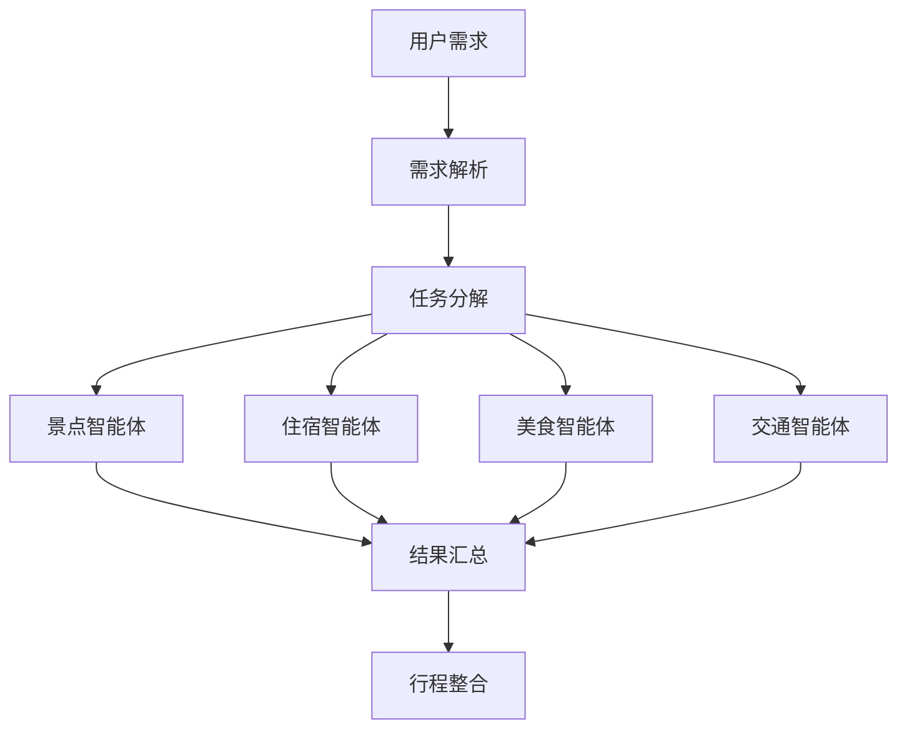

# 任务分解模块说明

## 📋 功能概述

任务分解模块负责将用户的结构化需求拆分为4个智能体的子任务，并管理任务的执行状态和进度。

## 🎯 核心功能

### 1. 预算自动分配
根据总预算按以下比例自动分摊：
- **住宿**: 30%
- **餐饮**: 25%
- **交通**: 15%
- **门票**: 20%
- **其他**: 10%

### 2. 智能体参数生成
为每个智能体生成专属的输入参数：

#### 景点智能体 (Attraction Agent)
```json
{
  "city_name": "北京",
  "travel_days": 3,
  "preferences": ["历史古迹"],
  "dislikes": ["爬山"],
  "ticket_budget": 1000,
  "traveler_count": 3
}
```

#### 住宿智能体 (Accommodation Agent)
```json
{
  "city_name": "北京",
  "check_in_date": "2026-05-20",
  "check_out_date": "2026-05-23",
  "nights": 3,
  "budget_per_night": 500.0,
  "location_preference": "靠近景点"
}
```

#### 美食智能体 (Food Agent)
```json
{
  "city_name": "北京",
  "travel_days": 3,
  "budget_per_person": 44.44,
  "cuisine_preference": "当地特色"
}
```

#### 交通智能体 (Transport Agent)
```json
{
  "city_name": "北京",
  "travel_days": 3,
  "budget": 800,
  "travel_date": "2026-05-20",
  "mode_preference": "transit"
}
```

### 3. 业务规则验证
- ✅ 出行天数: 1-30天
- ✅ 出行人数: 1-20人
- ✅ 最低预算: 每人每天100元

### 4. 任务状态管理
- `pending`: 任务已创建，等待执行
- `running`: 至少有一个子任务在执行
- `success`: 所有子任务完成
- `failed`: 有子任务失败

## 🔌 API 接口

### 1. 任务分解
**POST** `/api/v1/task/decompose`

```json
{
  "requirement_id": "req_xxx",
  "structured_requirement": {
    "city_name": "北京",
    "travel_days": 3,
    "total_budget": 5000,
    "travel_date": "2026-05-20",
    "traveler_count": 3,
    "preferences": ["历史古迹", "美食"],
    "dislikes": ["爬山"]
  }
}
```

### 2. 查询任务状态
**GET** `/api/v1/task/{task_id}`

返回主任务或子任务的状态信息，包括进度百分比。

### 3. 更新任务结果
**POST** `/api/v1/task/update/{task_id}`

供智能体调用，更新子任务的执行结果。

## 📊 数据流



## 💡 使用示例

详见 [任务分解测试示例.md](./任务分解测试示例.md)

## 📝 注意事项

1. **并行执行**: 4个子任务可以并行执行，没有依赖关系
2. **进度追踪**: 前端可轮询主任务ID获取实时进度
3. **容错处理**: 单个智能体失败不影响其他智能体执行
4. **数据存储**: 当前使用内存存储，生产环境需改为数据库

## 👥 负责人

- **开发**: 成员B (需求与协调负责人)
- **对接**: 成员C (智能体开发), 成员D (后端集成)