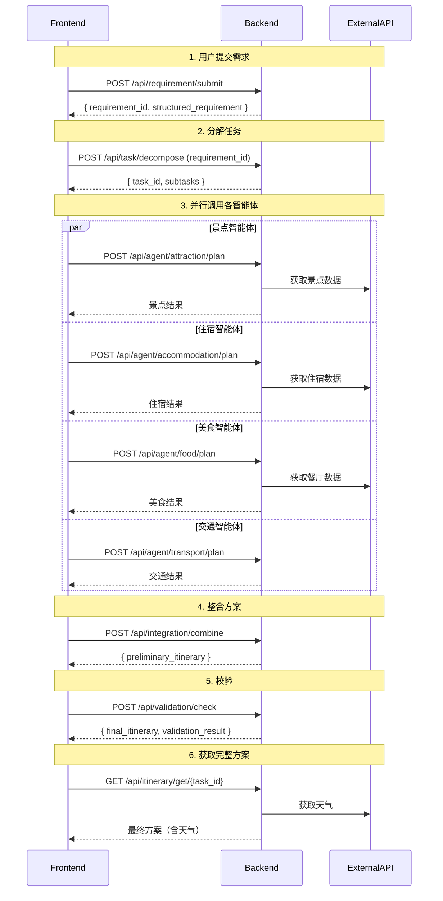

以下是按照您要求的层次结构生成的完整接口文档，可直接用于指导前后端开发。

---

# 多智能体旅游规划系统接口文档（完整版）

## 1. 概述与全局约定

### 1.1 认证方式

- **认证机制**：JWT（JSON Web Token）
- **传递方式**：在 HTTP Header 中携带  
  `Authorization: Bearer <access_token>`
- **Token 有效期**：`access_token` 有效期为 2 小时，`refresh_token` 有效期为 7 天（登录接口返回）
- **无需认证的接口**：
  - `POST /api/user/register`
  - `POST /api/user/login`
  - `GET /api/external/weather`
  - `POST /api/requirement/submit`（游客可提交，但保存需登录）

### 1.2 统一响应格式

所有接口返回 JSON 格式，结构如下：

```json
{
  "code": 200,
  "msg": "操作成功",
  "data": {}
}
```

- `code`：整型，业务状态码（见 1.3 错误码表）
- `msg`：字符串，提示信息
- `data`：对象或数组，具体数据

### 1.3 错误码表

| code | HTTP状态 | 说明 |
|------|----------|------|
| 200  | 200 OK | 成功 |
| 400  | 400 Bad Request | 参数错误（如缺失、格式不对、取值范围错误） |
| 401  | 401 Unauthorized | 未认证（未登录或 token 过期） |
| 403  | 403 Forbidden | 无权限（如删除他人行程） |
| 404  | 404 Not Found | 资源不存在 |
| 409  | 409 Conflict | 业务冲突（如重复保存行程） |
| 500  | 500 Internal Server Error | 服务器内部错误 |

**业务子码扩展（当需要更细粒度时，放在 code 中，例如）：**

| code   | 说明 |
|--------|------|
| 200001 | 需求解析成功但部分预算分配失败 |
| 400001 | 出行天数超过上限（30天） |
| 400002 | 预算过低（小于人数*100） |
| 401001 | Token 已过期 |
| 409001 | 行程已存在收藏夹 |

### 1.4 数据模型定义（所有对象）

#### 1.4.1 User（用户）

| 字段 | 类型 | 说明 |
|------|------|------|
| user_id | string | 用户唯一标识（UUID） |
| username | string | 用户名（3~20位字母数字） |
| email | string | 邮箱 |
| avatar_url | string \| null | 头像地址 |
| created_at | string | 注册时间（ISO 8601） |

#### 1.4.2 Requirement（用户需求）

| 字段 | 类型 | 说明 |
|------|------|------|
| requirement_id | string | 需求唯一标识 |
| user_id | string \| null | 关联的用户ID（未登录则为null） |
| user_input | string | 原始输入 |
| structured | StructuredRequirement | 结构化需求 |
| status | string | pending / processing / completed / failed |
| created_at | string | 创建时间 |
| updated_at | string | 更新时间 |

#### 1.4.3 StructuredRequirement（结构化需求）

| 字段 | 类型 | 必填 | 说明 | 示例 |
|------|------|------|------|------|
| city_name | string | 是 | 城市名称 | "北京" |
| travel_days | integer | 是 | 出行天数（1~30） | 3 |
| total_budget | float | 是 | 总预算（元） | 5000 |
| travel_date | string | 是 | 出发日期（YYYY-MM-DD） | "2026-05-20" |
| traveler_count | integer | 是 | 出行人数（≥1） | 3 |
| preferences | array | 否 | 兴趣偏好 | ["历史古迹","美食"] |
| dislikes | array | 否 | 不喜欢的内容 | ["爬山"] |
| accommodation_budget | float | 否 | 住宿预算（若未指定则系统分摊） | 1500 |
| food_budget | float | 否 | 餐饮预算 | 1200 |
| transport_budget | float | 否 | 交通预算 | 800 |
| ticket_budget | float | 否 | 门票预算 | 1000 |
| other_budget | float | 否 | 其他预算 | 500 |

#### 1.4.4 Subtask（子任务）

| 字段 | 类型 | 说明 |
|------|------|------|
| subtask_id | string | 子任务ID |
| agent_type | string | 智能体类型：attraction / accommodation / food / transport |
| parameters | object | 传递给智能体的参数 |
| status | string | pending / running / success / failed |
| result | object \| null | 智能体返回的结果 |

#### 1.4.5 Attraction（景点）

| 字段 | 类型 | 说明 |
|------|------|------|
| id | string | 景点ID |
| name | string | 名称 |
| address | string | 地址 |
| visit_duration | string | 建议游览时长（如"4小时"） |
| open_time | string | 开放时间（如"08:30-17:00"） |
| ticket_price | float | 门票价格（元） |
| rating | float | 评分（0~5） |
| tags | array | 标签（如["历史古迹"]） |

#### 1.4.6 Accommodation（住宿）

| 字段 | 类型 | 说明 |
|------|------|------|
| id | string | 住宿ID |
| name | string | 酒店名称 |
| address | string | 地址 |
| price_per_night | float | 每晚价格（元） |
| rating | float | 评分 |
| distance_to_center | string | 距离市中心距离 |
| tags | array | 标签（如["含早餐"]） |

#### 1.4.7 Restaurant（餐厅）

| 字段 | 类型 | 说明 |
|------|------|------|
| id | string | 餐厅ID |
| name | string | 餐厅名称 |
| address | string | 地址 |
| average_price | float | 人均价格（元） |
| rating | float | 评分 |
| cuisine | string | 菜系 |
| recommended_dishes | array | 推荐菜 |

#### 1.4.8 Transportation（交通段）

| 字段 | 类型 | 说明 |
|------|------|------|
| from | string | 起点名称 |
| to | string | 终点名称 |
| mode | string | 交通方式：步行/公交/地铁/打车 |
| duration | string | 耗时（如"50分钟"） |
| cost | float | 费用（元） |

#### 1.4.9 Activity（每日活动）

| 字段 | 类型 | 说明 |
|------|------|------|
| time | string | 时间段（如"09:30-13:30"） |
| type | string | 活动类型：breakfast / lunch / dinner / attraction / transport / free |
| location | string | 地点名称 |
| description | string | 描述 |
| cost | float \| null | 该项花费（可选） |

#### 1.4.10 Itinerary（行程单）

| 字段 | 类型 | 说明 |
|------|------|------|
| day | integer | 第几天（从1开始） |
| date | string | 日期（YYYY-MM-DD） |
| activities | array[Activity] | 当日活动列表 |

#### 1.4.11 FinalItinerary（最终行程方案）

| 字段 | 类型 | 说明 |
|------|------|------|
| task_id | string | 任务ID |
| requirement_id | string | 需求ID |
| city_name | string | 城市 |
| travel_days | integer | 天数 |
| travel_date | string | 出发日期 |
| total_budget | float | 总预算 |
| actual_cost | float | 实际花费 |
| itinerary | array[Itinerary] | 每日行程 |
| accommodation | Accommodation | 推荐住宿 |
| weather_forecast | array[Weather] | 天气预报（每日） |

#### 1.4.12 TaskStatus（任务状态）

| 字段 | 类型 | 说明 |
|------|------|------|
| task_id | string | 任务ID |
| status | string | pending / running / success / failed |
| progress | float | 进度百分比（0~100） |
| failed_subtasks | array | 失败的子任务ID列表 |
| message | string \| null | 状态描述 |

#### 1.4.13 Weather（天气）

| 字段 | 类型 | 说明 |
|------|------|------|
| date | string | 日期 |
| weather | string | 天气现象（晴/多云/雨...） |
| temperature | string | 气温范围（如"18-28℃"） |
| wind | string \| null | 风力 |
| humidity | string \| null | 湿度 |

### 1.5 调用流程图

#### 核心规划流程时序图（前端与后端交互）



---

## 2. 公共模块

### 2.1 用户管理接口

#### 2.1.1 用户注册

- **函数名**：`register_user`
- **URL**：`/api/user/register`
- **方法**：`POST`
- **认证**：不需要

**请求参数**

| 字段 | 类型 | 必填 | 说明 |
|------|------|------|------|
| username | string | 是 | 用户名（3~20位字母数字或下划线） |
| password | string | 是 | 密码（6~20位，至少包含字母和数字） |
| email | string | 是 | 邮箱 |

**成功响应**

```json
{
  "code": 200,
  "msg": "注册成功",
  "data": {
    "user_id": "550e8400-e29b-41d4-a716-446655440000",
    "username": "traveler123",
    "email": "user@example.com"
  }
}
```

**错误示例**（用户名已存在）

```json
{
  "code": 409,
  "msg": "用户名已存在",
  "data": null
}
```

#### 2.1.2 用户登录

- **函数名**：`login_user`
- **URL**：`/api/user/login`
- **方法**：`POST`
- **认证**：不需要

**请求参数**

| 字段 | 类型 | 必填 | 说明 |
|------|------|------|------|
| username | string | 是 | 用户名 |
| password | string | 是 | 密码 |

**成功响应**

```json
{
  "code": 200,
  "msg": "登录成功",
  "data": {
    "access_token": "eyJhbGciOiJIUzI1NiIs...",
    "refresh_token": "eyJhbGciOiJIUzI1NiIs...",
    "expires_in": 7200,
    "user": {
      "user_id": "550e8400-e29b-41d4-a716-446655440000",
      "username": "traveler123",
      "email": "user@example.com"
    }
  }
}
```

#### 2.1.3 获取用户信息

- **函数名**：`get_user_info`
- **URL**：`/api/user/info/{user_id}`
- **方法**：`GET`
- **认证**：需要（只能获取自己的信息）

**路径参数**

| 参数 | 类型 | 说明 |
|------|------|------|
| user_id | string | 用户ID |

**成功响应**

```json
{
  "code": 200,
  "msg": "获取成功",
  "data": {
    "user_id": "550e8400...",
    "username": "traveler123",
    "email": "user@example.com",
    "avatar_url": null,
    "created_at": "2026-01-01T00:00:00Z"
  }
}
```

#### 2.1.4 更新用户信息

- **函数名**：`update_user_info`
- **URL**：`/api/user/update`
- **方法**：`PUT`
- **认证**：需要

**请求参数**

| 字段 | 类型 | 必填 | 说明 |
|------|------|------|------|
| user_id | string | 是 | 用户ID |
| email | string | 否 | 新邮箱 |
| avatar_url | string | 否 | 头像地址 |
| password_old | string | 否 | 旧密码（修改密码时必填） |
| password_new | string | 否 | 新密码（修改密码时必填） |

**成功响应**

```json
{
  "code": 200,
  "msg": "更新成功",
  "data": null
}
```

### 2.2 外部数据接口

#### 2.2.1 获取天气

- **函数名**：`get_weather`
- **URL**：`/api/external/weather`
- **方法**：`GET`
- **认证**：不需要

**请求参数（Query）**

| 参数 | 类型 | 必填 | 说明 |
|------|------|------|------|
| city_name | string | 是 | 城市名称 |
| date | string | 否 | 日期（YYYY-MM-DD），不填返回未来3天 |

**成功响应**

```json
{
  "code": 200,
  "msg": "获取成功",
  "data": {
    "city_name": "北京",
    "forecast": [
      { "date": "2026-05-20", "weather": "晴", "temperature": "18-28℃", "wind": "东风3级", "humidity": "45%" }
    ]
  }
}
```

#### 2.2.2 获取地图/路线规划

- **函数名**：`get_route`
- **URL**：`/api/external/map/route`
- **方法**：`GET`
- **认证**：不需要（但建议后端缓存）

**请求参数（Query）**

| 参数 | 类型 | 必填 | 说明 |
|------|------|------|------|
| from | string | 是 | 起点名称或经纬度 |
| to | string | 是 | 终点名称或经纬度 |
| mode | string | 否 | 出行方式：walking / transit / driving，默认transit |

**成功响应**

```json
{
  "code": 200,
  "msg": "获取成功",
  "data": {
    "from": "故宫博物院",
    "to": "颐和园",
    "mode": "transit",
    "duration": "50分钟",
    "distance": "18公里",
    "cost": 5,
    "steps": [
      { "instruction": "步行至故宫站", "duration": "5分钟" },
      { "instruction": "乘坐地铁1号线至西单站", "duration": "15分钟" }
    ]
  }
}
```

#### 2.2.3 获取景点详情（扩展）

- **函数名**：`get_attraction_detail`
- **URL**：`/api/external/attraction_info/{attraction_id}`
- **方法**：`GET`
- **认证**：不需要

**路径参数**

| 参数 | 类型 | 说明 |
|------|------|------|
| attraction_id | string | 景点ID |

**成功响应**（类似 Attraction 模型，略）

---

## 3. 核心规划流程

### 3.1 需求提交

- **函数名**：`submit_requirement`
- **URL**：`/api/requirement/submit`
- **方法**：`POST`
- **认证**：可选（若提供`user_id`则关联用户）

**请求参数**

| 字段 | 类型 | 必填 | 约束 |
|------|------|------|------|
| user_input | string | 是 | 至少5个字符 |
| city_name | string | 是 | 真实城市名 |
| travel_days | integer | 是 | 1~30 |
| total_budget | float | 是 | ≥ traveler_count * 100 |
| travel_date | string | 是 | 不能早于今天，不能晚于今天+1年 |
| traveler_count | integer | 是 | 1~20 |
| preferences | array | 否 | 最多10个，每个≤20字符 |
| dislikes | array | 否 | 最多10个 |
| user_id | string | 否 | 登录用户的ID（从token获取） |

**业务规则**：
- 系统将根据 `total_budget` 自动分摊到各子类预算，分摊算法：住宿占30%，餐饮25%，交通15%，门票20%，其他10%（可调整）。
- 如果用户提供了 `preferences` 或 `dislikes`，智能体在推荐时会过滤。

**成功响应**

```json
{
  "code": 200,
  "msg": "需求解析成功",
  "data": {
    "requirement_id": "req_20260517_001",
    "structured_requirement": {
      "city_name": "北京",
      "travel_days": 3,
      "total_budget": 5000,
      "travel_date": "2026-05-20",
      "traveler_count": 3,
      "preferences": ["历史古迹", "美食"],
      "dislikes": ["爬山"],
      "accommodation_budget": 1500,
      "food_budget": 1200,
      "transport_budget": 800,
      "ticket_budget": 1000,
      "other_budget": 500
    }
  }
}
```

**失败示例**（预算过低）

```json
{
  "code": 400002,
  "msg": "预算过低，至少需要每人每天100元",
  "data": null
}
```

### 3.2 任务分解

- **函数名**：`decompose_task`
- **URL**：`/api/task/decompose`
- **方法**：`POST`
- **认证**：需要

**请求参数**

| 字段 | 类型 | 必填 |
|------|------|------|
| requirement_id | string | 是 |
| structured_requirement | object | 是 |

**业务规则**：
- 生成4个子任务（景点、住宿、美食、交通），并存储到数据库，状态为 `pending`。
- 返回的 `task_id` 用于后续轮询状态。

**成功响应**

```json
{
  "code": 200,
  "msg": "任务分解成功",
  "data": {
    "task_id": "task_20260517_001",
    "subtasks": [
      {
        "subtask_id": "subtask_001",
        "agent_type": "attraction",
        "parameters": { "city_name": "北京", "travel_days": 3, "preferences": ["历史古迹"], "dislikes": ["爬山"], "ticket_budget": 1000 }
      },
      { "subtask_id": "subtask_002", "agent_type": "accommodation", "parameters": { "city_name": "北京", "travel_days": 3, "budget": 1500, "preferences": ["靠近景点", "安静"] } },
      { "subtask_id": "subtask_003", "agent_type": "food", "parameters": { "city_name": "北京", "travel_days": 3, "budget": 1200, "preferences": ["当地特色"] } },
      { "subtask_id": "subtask_004", "agent_type": "transport", "parameters": { "city_name": "北京", "travel_days": 3, "budget": 800 } }
    ]
  }
}
```

### 3.3 智能体规划（4个子接口）

> 四个接口的通用说明：
> - 请求方法：`POST`
> - 认证：需要
> - 超时时间：5秒，失败后自动重试最多2次
> - 返回结构统一为 `{ code, msg, data }`，data 中包含 `subtask_id`, `agent_type` 以及各自的推荐列表。

#### 3.3.1 景点智能体

- **函数名**：`agent_attraction_plan`
- **URL**：`/api/agent/attraction/plan`
- **请求参数**：

```json
{
  "subtask_id": "subtask_001",
  "parameters": {
    "city_name": "北京",
    "travel_days": 3,
    "preferences": ["历史古迹"],
    "dislikes": ["爬山"],
    "ticket_budget": 1000
  }
}
```

- **成功响应**（同原始文档，略）
- **边界条件**：若找不到符合偏好的景点，则返回城市最热门的5个景点，并在 `msg` 中提示“未完全匹配偏好”。

#### 3.3.2 住宿智能体

- **函数名**：`agent_accommodation_plan`
- **URL**：`/api/agent/accommodation/plan`

#### 3.3.3 美食智能体

- **函数名**：`agent_food_plan`
- **URL**：`/api/agent/food/plan`

#### 3.3.4 交通智能体

- **函数名**：`agent_transport_plan`
- **URL**：`/api/agent/transport/plan`

> 交通智能体返回的 `transportations` 数组元素为 `{ from, to, mode, duration, cost }`。

### 3.4 整合与校验

#### 3.4.1 方案整合

- **函数名**：`combine_integration`
- **URL**：`/api/integration/combine`
- **方法**：`POST`
- **认证**：需要

**请求参数**

```json
{
  "task_id": "task_20260517_001",
  "agent_results": [ /* 4个智能体的结果数组，结构同各智能体返回的data */ ]
}
```

**业务规则**：
- 按照时间顺序将景点、餐饮、交通拼接成每日行程（默认上午景点、中午午餐、下午景点、晚餐自由活动）。
- 如果总花费超出预算，会尝试替换部分推荐为更便宜的选项，并在 `msg` 中提示调整。
- 整合失败时返回 `code 500`，并在 `data` 中给出 `failed_agent` 列表。

**成功响应**（同原始文档，给出 `preliminary_itinerary`）

#### 3.4.2 行程校验

- **函数名**：`validate_itinerary`
- **URL**：`/api/validation/check`
- **方法**：`POST`
- **认证**：需要

**请求参数**

```json
{
  "task_id": "task_20260517_001",
  "preliminary_itinerary": [ /* 每日行程数组 */ ],
  "structured_requirement": { /* 结构化需求 */ }
}
```

**校验内容**：
- 活动时间是否冲突（如两个景点时间重叠）
- 景点是否在开放时间内
- 总费用是否在预算内
- 是否包含用户不喜欢的活动类型

**成功响应**

```json
{
  "code": 200,
  "msg": "行程校验通过",
  "data": {
    "task_id": "task_20260517_001",
    "final_itinerary": [ /* 最终行程（可能自动调整过） */ ],
    "validation_result": {
      "is_valid": true,
      "total_cost": 4850,
      "conflicts": [],
      "suggestions": ["建议提前预订故宫门票"]
    }
  }
}
```

如果 `is_valid` 为 `false`，`conflicts` 会列出具体问题，`suggestions` 给出修改建议。前端可据此重新调用整合或修改需求。

### 3.5 获取最终方案

- **函数名**：`get_final_itinerary`
- **URL**：`/api/itinerary/get/{task_id}`
- **方法**：`GET`
- **认证**：需要

**路径参数**

| 参数 | 类型 |
|------|------|
| task_id | string |

**业务逻辑**：
- 从缓存或数据库读取已校验通过的最终行程。
- 自动调用天气接口补充天气预报。
- 若任务状态不是 `success`，返回 `404` 并提示任务未完成。

**成功响应**（同原始文档，包含 `weather_forecast`）

---

## 4. 辅助功能

### 4.1 保存/导出行程

#### 4.1.1 保存行程到收藏夹

- **函数名**：`save_itinerary`
- **URL**：`/api/itinerary/save`
- **方法**：`POST`
- **认证**：需要

**请求参数**

| 字段 | 类型 | 必填 |
|------|------|------|
| task_id | string | 是 |
| user_id | string | 是（从token获取） |
| name | string | 否（默认“我的行程+日期”） |

**成功响应**

```json
{
  "code": 200,
  "msg": "保存成功",
  "data": { "saved_itinerary_id": "save_001" }
}
```

#### 4.1.2 获取用户保存的行程列表

- **函数名**：`get_saved_itinerary_list`
- **URL**：`/api/itinerary/saved_list/{user_id}`
- **方法**：`GET`
- **认证**：需要

**响应**

```json
{
  "code": 200,
  "msg": "获取成功",
  "data": [
    {
      "saved_itinerary_id": "save_001",
      "name": "北京三日游",
      "city_name": "北京",
      "travel_days": 3,
      "created_at": "2026-05-17T10:00:00Z"
    }
  ]
}
```

#### 4.1.3 删除保存的行程

- **函数名**：`delete_saved_itinerary`
- **URL**：`/api/itinerary/delete_saved/{saved_itinerary_id}`
- **方法**：`DELETE`
- **认证**：需要（只能删除自己的）

#### 4.1.4 导出行程

- **函数名**：`export_itinerary`
- **URL**：`/api/itinerary/export/{task_id}`
- **方法**：`GET`
- **认证**：需要

**查询参数**

| 参数 | 类型 | 必填 | 说明 |
|------|------|------|------|
| format | string | 是 | `json` 或 `pdf` |

**响应**：
- `format=json`：返回 JSON（同 `/api/itinerary/get` 结构）
- `format=pdf`：返回 PDF 文件流，Content-Type: `application/pdf`

### 4.2 反馈与评分

#### 4.2.1 提交行程反馈

- **函数名**：`submit_feedback`
- **URL**：`/api/feedback/submit`
- **方法**：`POST`
- **认证**：需要

**请求参数**

| 字段 | 类型 | 必填 |
|------|------|------|
| task_id | string | 是 |
| rating | integer | 是（1~5星） |
| comment | string | 否 |
| tags | array | 否（如["行程太赶","景点不错"]） |

**成功响应**

```json
{
  "code": 200,
  "msg": "感谢您的反馈",
  "data": null
}
```

#### 4.2.2 获取反馈列表（管理员）

- **函数名**：`get_feedback_list`
- **URL**：`/api/feedback/list`
- **方法**：`GET`
- **认证**：需要（仅管理员角色）

**请求参数**（分页）

| 参数 | 类型 | 默认 |
|------|------|------|
| page | integer | 1 |
| size | integer | 20 |

**响应**（略）

### 4.3 任务状态查询

#### 4.3.1 获取任务状态

- **函数名**：`get_task_status`
- **URL**：`/api/task/status/{task_id}`
- **方法**：`GET`
- **认证**：需要

**响应**

```json
{
  "code": 200,
  "msg": "获取成功",
  "data": {
    "task_id": "task_20260517_001",
    "status": "running",
    "progress": 75.0,
    "failed_subtasks": [],
    "message": "正在调用美食智能体..."
  }
}
```

**状态枚举**：
- `pending`：任务已创建，尚未开始
- `running`：至少有一个子任务在执行
- `success`：所有子任务成功，整合校验通过
- `failed`：有子任务失败或整合失败

前端可用此接口轮询（建议间隔2秒）直至状态变为 `success` 或 `failed`。

#### 4.3.2 取消任务

- **函数名**：`cancel_task`
- **URL**：`/api/task/cancel/{task_id}`
- **方法**：`POST`
- **认证**：需要

**业务**：将状态标记为 `failed`，并停止后续子任务执行。

**响应**

```json
{
  "code": 200,
  "msg": "任务已取消",
  "data": null
}
```

---

## 5. 附录

### 5.1 Postman 示例

为方便开发调试，我们提供了 Postman Collection 文件，包含所有接口的示例请求和响应。

**下载地址**：`https://example.com/docs/travel-agent.postman_collection.json`（请替换为实际地址）

**环境变量**：
- `base_url`：`http://localhost:8000`
- `access_token`：登录后自动设置

### 5.2 常见问题（FAQ）

**Q1：为什么我的需求提交后，智能体返回的景点和我的偏好不符？**  
A：系统优先匹配偏好，但如果数据库中无足够符合的景点，会返回热门景点作为备选，并在 `msg` 中提示。您可以通过修改需求（如扩大偏好范围）重新规划。

**Q2：异步任务需要轮询多久？**  
A：通常5~10秒内完成。若超过30秒，请检查网络或联系管理员。您可以通过 `GET /api/task/status/{task_id}` 查看失败子任务。

**Q3：如何修改已提交的需求？**  
A：当前版本不支持直接修改，您可以新建一个需求。后续版本将增加需求编辑功能。

**Q4：导出的 PDF 包含地图和图片吗？**  
A：PDF 为纯文字表格形式，包含每日活动、地点、时间、费用。不包含地图截图。

**Q5：智能体结果可以缓存吗？**  
A：可以。同一个城市、同一天数、相同偏好组合的结果会缓存1小时，以降低外部API调用成本。

**Q6：发生 `401` 错误怎么办？**  
A：说明 access_token 已过期，请调用登录接口获取新的 token，或使用 refresh_token 换取（本版未提供刷新接口，下个版本支持）。

**Q7：接口文档中某些对象字段（如 `avatar_url`）返回 null 是什么意思？**  
A：按照全局约定，无数据时返回 `null`，前端需做判空处理。

---

**文档版本**：v1.0  
**最后更新**：2026-05-18  
**维护者**：多智能体旅游规划系统团队